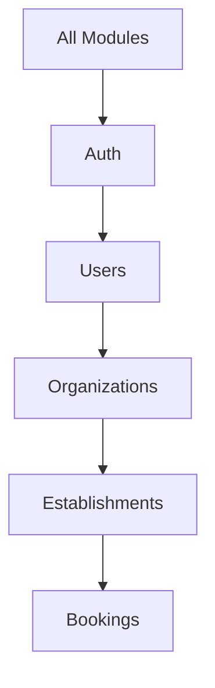

# 🏗️ Architecture Context

> Auto-généré et mis à jour par les agents Claude Code

## Vue d'ensemble

```
┌─────────────────────────────────────────────────────────────┐
│                        CLIENT                                │
│  ┌─────────────┐  ┌─────────────┐  ┌─────────────────────┐  │
│  │  Next.js    │  │   Mobile    │  │   Admin Dashboard   │  │
│  │  (Web App)  │  │   (Expo)    │  │   (if applicable)   │  │
│  └──────┬──────┘  └──────┬──────┘  └──────────┬──────────┘  │
└─────────┼────────────────┼───────────────────┼──────────────┘
          │                │                   │
          └────────────────┼───────────────────┘
                           │
                           ▼
┌─────────────────────────────────────────────────────────────┐
│                     API GATEWAY                              │
│  ┌─────────────────────────────────────────────────────┐    │
│  │                    NestJS API                        │    │
│  │  ┌─────────┐  ┌─────────┐  ┌─────────┐  ┌────────┐ │    │
│  │  │  Auth   │  │ Modules │  │  Guards │  │ Queue  │ │    │
│  │  │  JWT    │  │  CRUD   │  │  RBAC   │  │ BullMQ │ │    │
│  │  └─────────┘  └─────────┘  └─────────┘  └────────┘ │    │
│  └─────────────────────────────────────────────────────┘    │
└─────────────────────────────────────────────────────────────┘
                           │
          ┌────────────────┼────────────────┐
          ▼                ▼                ▼
   ┌────────────┐   ┌────────────┐   ┌────────────┐
   │ PostgreSQL │   │   Redis    │   │  Storage   │
   │  (Prisma)  │   │  (Cache)   │   │   (S3)     │
   └────────────┘   └────────────┘   └────────────┘
```

## Modules

<!-- Auto-updated par docs-writer agent -->

| Module | Description | Status | Routes API | Routes Web |
|--------|-------------|--------|------------|------------|
| auth | Authentification JWT | ⏳ | /api/auth/* | /login, /register |
| users | Gestion utilisateurs | ⏳ | /api/users/* | /settings |
| organizations | Multi-tenancy | ⏳ | /api/orgs/* | /dashboard/[orgId] |

## Data Model

```prisma
// Modèles principaux - voir prisma/schema.prisma pour détails

model User {
  id              String @id @default(cuid())
  email           String @unique
  // ... voir schema complet
}

model Organization {
  id        String @id @default(cuid())
  name      String
  slug      String @unique
  // ...
}
```

## Dépendances entre Modules



## Conventions

### API
- Tous les endpoints préfixés `/api/v1/`
- Authentification via JWT Bearer token
- Multi-tenancy via `organizationId` sur toutes les entités
- Soft delete par défaut (champ `deletedAt`)
- Pagination obligatoire sur les listes

### Frontend
- App Router Next.js 16+
- Server Components par défaut
- Route groups: `(auth)`, `(dashboard)`, `(public)`
- Composants locaux dans `_components/`

### Mobile
- Expo Router
- Tab navigation principale
- Stack navigation par feature

---

*Dernière mise à jour automatique par docs-writer agent*
