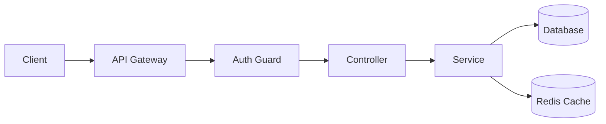

# ADR-{NNN}: {TITLE}

## Status

`PROPOSED` | `ACCEPTED` | `DEPRECATED` | `SUPERSEDED by ADR-XXX`

## Date

{YYYY-MM-DD}

## Contexte

{Pourquoi cette décision est nécessaire. Quel problème résout-on ? Quel est le contexte technique et business ?}

## Décision

{Ce qui a été décidé. Soyez précis et concis.}

## Conséquences

### Positives ✅
- {Conséquence positive 1}
- {Conséquence positive 2}

### Négatives ⚠️
- {Trade-off accepté 1}
- {Limitation connue 1}

### Risques 🔴
- {Risque identifié 1} → Mitigation: {stratégie}
- {Risque identifié 2} → Mitigation: {stratégie}

## Alternatives Considérées

### Option A: {Nom}
**Description**: {brève description}

| Pros | Cons |
|------|------|
| ✅ {avantage} | ❌ {inconvénient} |

**Raison du rejet**: {pourquoi non retenue}

### Option B: {Nom} ← **RETENUE**
**Description**: {brève description}

| Pros | Cons |
|------|------|
| ✅ {avantage} | ⚠️ {trade-off accepté} |

**Raison du choix**: {pourquoi retenue}

## Implémentation

### Modèle de Données

```prisma
model Example {
  id        String   @id @default(cuid())
  name      String
  createdAt DateTime @default(now())
  updatedAt DateTime @updatedAt
  
  @@index([name])
}
```

### API Endpoints

| Method | Path | Description | Auth |
|--------|------|-------------|------|
| POST | `/api/v1/examples` | Create | JWT + RBAC |
| GET | `/api/v1/examples` | List (paginated) | JWT |
| GET | `/api/v1/examples/:id` | Get one | JWT + Owner |
| PATCH | `/api/v1/examples/:id` | Update | JWT + Owner |
| DELETE | `/api/v1/examples/:id` | Soft delete | JWT + Owner |

### Composants Frontend

```
apps/web/app/(dashboard)/[orgId]/examples/
├── page.tsx              # Liste
├── [id]/page.tsx         # Détail
├── new/page.tsx          # Création
└── _components/
    ├── example-list.tsx
    ├── example-form.tsx
    └── example-card.tsx
```

### Performance Budget

| Métrique | Target | Max acceptable |
|----------|--------|----------------|
| API Response (P95) | <100ms | <200ms |
| Bundle impact | <5KB | <15KB |
| Lighthouse impact | 0 | -5 points |

### Sécurité

- **Authentication**: JWT Bearer token
- **Authorization**: RBAC - rôles `ADMIN`, `MEMBER`
- **Validation**: Zod schema côté serveur
- **Rate limiting**: 100 req/min/user

## Diagramme



## Références

- **Spec**: `docs/claude/working-notes/{slug}.md`
- **Related ADRs**: ADR-XXX, ADR-YYY
- **External docs**: {liens}

---

## Changelog

| Date | Changement |
|------|------------|
| {date} | Création initiale |
